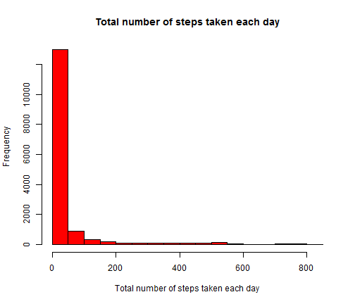
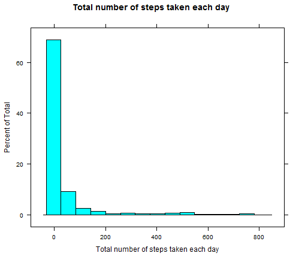
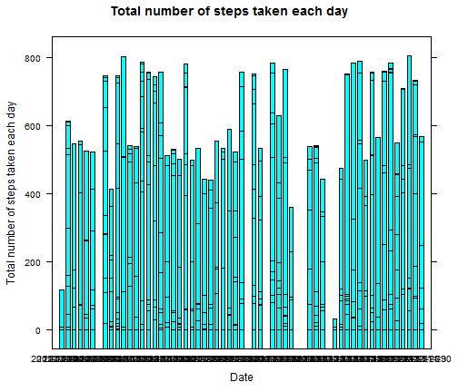
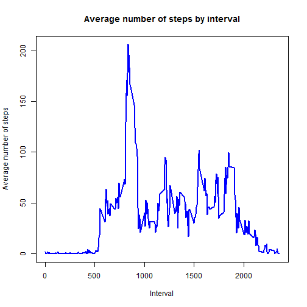
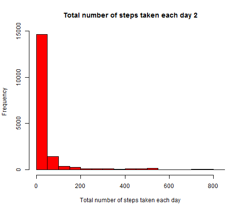
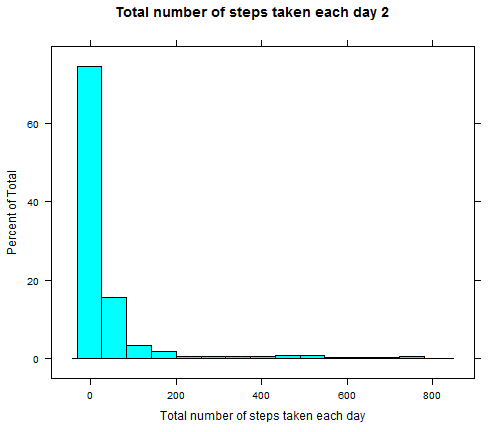
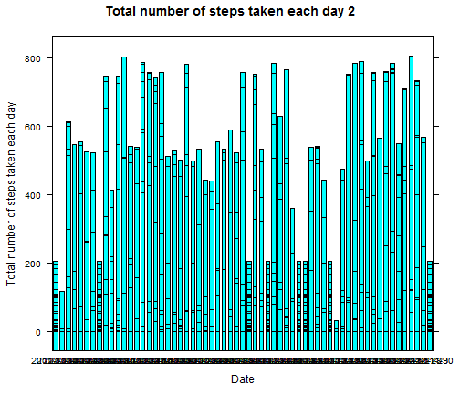
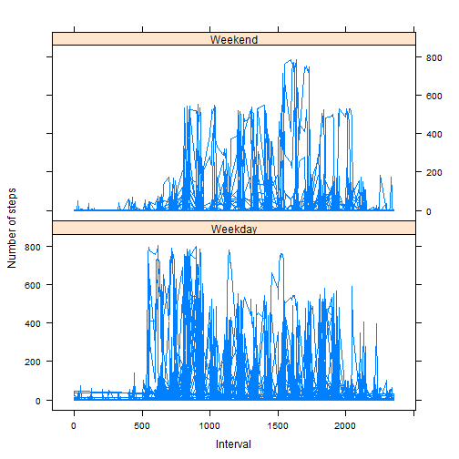

Peer Assessment 1 for Reproducible Research
========================================================

Loading and preprocessing the data
--------------------------------------------------------

First load data using read.csv() function and show the first 3 rows


```r
data <- read.csv("activity.csv")
head(data, 3)
```

```
##   steps       date interval
## 1    NA 2012-10-01        0
## 2    NA 2012-10-01        5
## 3    NA 2012-10-01       10
```

```r
tail(data, 3)
```

```
##       steps       date interval
## 17566    NA 2012-11-30     2345
## 17567    NA 2012-11-30     2350
## 17568    NA 2012-11-30     2355
```


For futher analysis add 1 column: 

weekdays (factor)

```r
data$weekday <- factor(weekdays(as.POSIXlt(data$date)))
head(data, 3)
```

```
##   steps       date interval weekday
## 1    NA 2012-10-01        0  Monday
## 2    NA 2012-10-01        5  Monday
## 3    NA 2012-10-01       10  Monday
```

```r
tail(data, 3)
```

```
##       steps       date interval weekday
## 17566    NA 2012-11-30     2345  Friday
## 17567    NA 2012-11-30     2350  Friday
## 17568    NA 2012-11-30     2355  Friday
```


 What is mean total number of steps taken per day?
--------------------------------------------------------
### Make a histogram of the total number of steps taken each day

* The first histogram shows frequency, how often is number of steps in observations


```r
hist(data$steps, main = "Total number of steps taken each day", xlab = "Total number of steps taken each day", 
    col = "red")
```

 


* The second histogram shows percent of total steps 

```r
library(lattice)
histogram(data$steps, main = "Total number of steps taken each day", xlab = "Total number of steps taken each day")
```

 


* And the third shows total number of steps per each day

```r
barchart(data$steps ~ data$date, data, xlab = "Date", ylab = "Total number of steps taken each day", 
    main = "Total number of steps taken each day")
```

 


### Calculate and report the mean and median total number of steps taken per day

Mean for total steps number and per day

```r
by1 <- list(data$date)
mean(data$steps, na.rm = TRUE)
```

```
## [1] 37.38
```

```r
aggregate(data$steps, by1, mean)
```

```
##       Group.1       x
## 1  2012-10-01      NA
## 2  2012-10-02  0.4375
## 3  2012-10-03 39.4167
## 4  2012-10-04 42.0694
## 5  2012-10-05 46.1597
## 6  2012-10-06 53.5417
## 7  2012-10-07 38.2465
## 8  2012-10-08      NA
## 9  2012-10-09 44.4826
## 10 2012-10-10 34.3750
## 11 2012-10-11 35.7778
## 12 2012-10-12 60.3542
## 13 2012-10-13 43.1458
## 14 2012-10-14 52.4236
## 15 2012-10-15 35.2049
## 16 2012-10-16 52.3750
## 17 2012-10-17 46.7083
## 18 2012-10-18 34.9167
## 19 2012-10-19 41.0729
## 20 2012-10-20 36.0938
## 21 2012-10-21 30.6285
## 22 2012-10-22 46.7361
## 23 2012-10-23 30.9653
## 24 2012-10-24 29.0104
## 25 2012-10-25  8.6528
## 26 2012-10-26 23.5347
## 27 2012-10-27 35.1354
## 28 2012-10-28 39.7847
## 29 2012-10-29 17.4236
## 30 2012-10-30 34.0938
## 31 2012-10-31 53.5208
## 32 2012-11-01      NA
## 33 2012-11-02 36.8056
## 34 2012-11-03 36.7049
## 35 2012-11-04      NA
## 36 2012-11-05 36.2465
## 37 2012-11-06 28.9375
## 38 2012-11-07 44.7326
## 39 2012-11-08 11.1771
## 40 2012-11-09      NA
## 41 2012-11-10      NA
## 42 2012-11-11 43.7778
## 43 2012-11-12 37.3785
## 44 2012-11-13 25.4722
## 45 2012-11-14      NA
## 46 2012-11-15  0.1424
## 47 2012-11-16 18.8924
## 48 2012-11-17 49.7882
## 49 2012-11-18 52.4653
## 50 2012-11-19 30.6979
## 51 2012-11-20 15.5278
## 52 2012-11-21 44.3993
## 53 2012-11-22 70.9271
## 54 2012-11-23 73.5903
## 55 2012-11-24 50.2708
## 56 2012-11-25 41.0903
## 57 2012-11-26 38.7569
## 58 2012-11-27 47.3819
## 59 2012-11-28 35.3576
## 60 2012-11-29 24.4688
## 61 2012-11-30      NA
```


Median for total steps number and per day

```r
median(data$steps, na.rm = TRUE)
```

```
## [1] 0
```

```r
aggregate(data$steps, by1, median)
```

```
##       Group.1  x
## 1  2012-10-01 NA
## 2  2012-10-02  0
## 3  2012-10-03  0
## 4  2012-10-04  0
## 5  2012-10-05  0
## 6  2012-10-06  0
## 7  2012-10-07  0
## 8  2012-10-08 NA
## 9  2012-10-09  0
## 10 2012-10-10  0
## 11 2012-10-11  0
## 12 2012-10-12  0
## 13 2012-10-13  0
## 14 2012-10-14  0
## 15 2012-10-15  0
## 16 2012-10-16  0
## 17 2012-10-17  0
## 18 2012-10-18  0
## 19 2012-10-19  0
## 20 2012-10-20  0
## 21 2012-10-21  0
## 22 2012-10-22  0
## 23 2012-10-23  0
## 24 2012-10-24  0
## 25 2012-10-25  0
## 26 2012-10-26  0
## 27 2012-10-27  0
## 28 2012-10-28  0
## 29 2012-10-29  0
## 30 2012-10-30  0
## 31 2012-10-31  0
## 32 2012-11-01 NA
## 33 2012-11-02  0
## 34 2012-11-03  0
## 35 2012-11-04 NA
## 36 2012-11-05  0
## 37 2012-11-06  0
## 38 2012-11-07  0
## 39 2012-11-08  0
## 40 2012-11-09 NA
## 41 2012-11-10 NA
## 42 2012-11-11  0
## 43 2012-11-12  0
## 44 2012-11-13  0
## 45 2012-11-14 NA
## 46 2012-11-15  0
## 47 2012-11-16  0
## 48 2012-11-17  0
## 49 2012-11-18  0
## 50 2012-11-19  0
## 51 2012-11-20  0
## 52 2012-11-21  0
## 53 2012-11-22  0
## 54 2012-11-23  0
## 55 2012-11-24  0
## 56 2012-11-25  0
## 57 2012-11-26  0
## 58 2012-11-27  0
## 59 2012-11-28  0
## 60 2012-11-29  0
## 61 2012-11-30 NA
```


What is the average daily activity pattern?
--------------------------------------------
### Make a time series plot (i.e. type = "l") of the 5-minute interval (x-axis) and the average number of steps taken, averaged across all days (y-axis)


```r
by2 <- list(data$interval)
c <- aggregate(data$steps, by2, mean, na.rm = TRUE)
colnames(c) <- c("Interval", "Average")
plot(c$Interval, c$Average, type = "l", main = "Average number of steps by interval", 
    xlab = "Interval", ylab = "Average number of steps", lwd = 2, col = "blue")
```

 


### Which 5-minute interval, on average across all the days in the dataset, contains the maximum number of steps?

```r
c[which.max(c$Average), 1]
```

```
## [1] 835
```


As we can see, the maxmum steps is in interval **835**. 
Each hour contains 60 minutes so 835/60=13,9. So at **13:55-14:00** is the maximum steps

Imputing missing values
--------------------------------------------
Note that there are a number of days/intervals where there are missing values (coded as NA). The presence of missing days may introduce bias into some calculations or summaries of the data.

### Calculate and report the total number of missing values in the dataset (i.e. the total number of rows with NAs)


```r
colSums(is.na(data))
```

```
##    steps     date interval  weekday 
##     2304        0        0        0
```

As we can see there are 2304 rows with missing values

### Devise a strategy for filling in all of the missing values in the dataset. The strategy does not need to be sophisticated. For example, you could use the mean/median for that day, or the mean for that 5-minute interval, etc.

Replace NAs with average in interval
First define Nas as bad data and then replace them with value of average


```r
bad <- !complete.cases(data$steps)
```


### Create a new dataset that is equal to the original dataset but with the missing data filled in.


```r
data[bad, ]$steps <- c[which(c$Interval %in% data[bad, ]$interval), 2]
head(data)
```

```
##     steps       date interval weekday
## 1 1.71698 2012-10-01        0  Monday
## 2 0.33962 2012-10-01        5  Monday
## 3 0.13208 2012-10-01       10  Monday
## 4 0.15094 2012-10-01       15  Monday
## 5 0.07547 2012-10-01       20  Monday
## 6 2.09434 2012-10-01       25  Monday
```

```r
tail(data)
```

```
##        steps       date interval weekday
## 17563 2.6038 2012-11-30     2330  Friday
## 17564 4.6981 2012-11-30     2335  Friday
## 17565 3.3019 2012-11-30     2340  Friday
## 17566 0.6415 2012-11-30     2345  Friday
## 17567 0.2264 2012-11-30     2350  Friday
## 17568 1.0755 2012-11-30     2355  Friday
```


Check if there are NAs

```r
colSums(is.na(data))
```

```
##    steps     date interval  weekday 
##        0        0        0        0
```


### Make a histogram of the total number of steps taken each day and Calculate and report the mean and median total number of steps taken per day. Do these values differ from the estimates from the first part of the assignment? What is the impact of imputing missing data on the estimates of the total daily number of steps?

Now we can compare 
* histogram 

```r
hist(data$steps, main = "Total number of steps taken each day 2", xlab = "Total number of steps taken each day", 
    col = "red")
```

 

```r
histogram(data$steps, xlab = "Total number of steps taken each day", main = "Total number of steps taken each day 2")
```

 

```r
barchart(data$steps ~ data$date, data, xlab = "Date", ylab = "Total number of steps taken each day", 
    main = "Total number of steps taken each day 2")
```

 

* and mean(s)
Mean for total steps number and per day

```r
by1 <- list(data$date)
mean(data$steps, na.rm = TRUE)
```

```
## [1] 37.38
```

```r
aggregate(data$steps, by1, mean)
```

```
##       Group.1       x
## 1  2012-10-01 37.3826
## 2  2012-10-02  0.4375
## 3  2012-10-03 39.4167
## 4  2012-10-04 42.0694
## 5  2012-10-05 46.1597
## 6  2012-10-06 53.5417
## 7  2012-10-07 38.2465
## 8  2012-10-08 37.3826
## 9  2012-10-09 44.4826
## 10 2012-10-10 34.3750
## 11 2012-10-11 35.7778
## 12 2012-10-12 60.3542
## 13 2012-10-13 43.1458
## 14 2012-10-14 52.4236
## 15 2012-10-15 35.2049
## 16 2012-10-16 52.3750
## 17 2012-10-17 46.7083
## 18 2012-10-18 34.9167
## 19 2012-10-19 41.0729
## 20 2012-10-20 36.0938
## 21 2012-10-21 30.6285
## 22 2012-10-22 46.7361
## 23 2012-10-23 30.9653
## 24 2012-10-24 29.0104
## 25 2012-10-25  8.6528
## 26 2012-10-26 23.5347
## 27 2012-10-27 35.1354
## 28 2012-10-28 39.7847
## 29 2012-10-29 17.4236
## 30 2012-10-30 34.0938
## 31 2012-10-31 53.5208
## 32 2012-11-01 37.3826
## 33 2012-11-02 36.8056
## 34 2012-11-03 36.7049
## 35 2012-11-04 37.3826
## 36 2012-11-05 36.2465
## 37 2012-11-06 28.9375
## 38 2012-11-07 44.7326
## 39 2012-11-08 11.1771
## 40 2012-11-09 37.3826
## 41 2012-11-10 37.3826
## 42 2012-11-11 43.7778
## 43 2012-11-12 37.3785
## 44 2012-11-13 25.4722
## 45 2012-11-14 37.3826
## 46 2012-11-15  0.1424
## 47 2012-11-16 18.8924
## 48 2012-11-17 49.7882
## 49 2012-11-18 52.4653
## 50 2012-11-19 30.6979
## 51 2012-11-20 15.5278
## 52 2012-11-21 44.3993
## 53 2012-11-22 70.9271
## 54 2012-11-23 73.5903
## 55 2012-11-24 50.2708
## 56 2012-11-25 41.0903
## 57 2012-11-26 38.7569
## 58 2012-11-27 47.3819
## 59 2012-11-28 35.3576
## 60 2012-11-29 24.4688
## 61 2012-11-30 37.3826
```

* and median(s)
Median for total steps number and per day

```r
median(data$steps, na.rm = TRUE)
```

```
## [1] 0
```

```r
aggregate(data$steps, by1, median)
```

```
##       Group.1     x
## 1  2012-10-01 34.11
## 2  2012-10-02  0.00
## 3  2012-10-03  0.00
## 4  2012-10-04  0.00
## 5  2012-10-05  0.00
## 6  2012-10-06  0.00
## 7  2012-10-07  0.00
## 8  2012-10-08 34.11
## 9  2012-10-09  0.00
## 10 2012-10-10  0.00
## 11 2012-10-11  0.00
## 12 2012-10-12  0.00
## 13 2012-10-13  0.00
## 14 2012-10-14  0.00
## 15 2012-10-15  0.00
## 16 2012-10-16  0.00
## 17 2012-10-17  0.00
## 18 2012-10-18  0.00
## 19 2012-10-19  0.00
## 20 2012-10-20  0.00
## 21 2012-10-21  0.00
## 22 2012-10-22  0.00
## 23 2012-10-23  0.00
## 24 2012-10-24  0.00
## 25 2012-10-25  0.00
## 26 2012-10-26  0.00
## 27 2012-10-27  0.00
## 28 2012-10-28  0.00
## 29 2012-10-29  0.00
## 30 2012-10-30  0.00
## 31 2012-10-31  0.00
## 32 2012-11-01 34.11
## 33 2012-11-02  0.00
## 34 2012-11-03  0.00
## 35 2012-11-04 34.11
## 36 2012-11-05  0.00
## 37 2012-11-06  0.00
## 38 2012-11-07  0.00
## 39 2012-11-08  0.00
## 40 2012-11-09 34.11
## 41 2012-11-10 34.11
## 42 2012-11-11  0.00
## 43 2012-11-12  0.00
## 44 2012-11-13  0.00
## 45 2012-11-14 34.11
## 46 2012-11-15  0.00
## 47 2012-11-16  0.00
## 48 2012-11-17  0.00
## 49 2012-11-18  0.00
## 50 2012-11-19  0.00
## 51 2012-11-20  0.00
## 52 2012-11-21  0.00
## 53 2012-11-22  0.00
## 54 2012-11-23  0.00
## 55 2012-11-24  0.00
## 56 2012-11-25  0.00
## 57 2012-11-26  0.00
## 58 2012-11-27  0.00
## 59 2012-11-28  0.00
## 60 2012-11-29  0.00
## 61 2012-11-30 34.11
```


As we can see replacing missing values with mean does not impact on summary data for mean and median. It only changes the histogram: frequency of steps has been changed.


Are there differences in activity patterns between weekdays and weekends?
----------------------------------------------------------

For this part the weekdays() function may be of some help here. Use the dataset with the filled-in missing values for this part.

### Create a new factor variable in the dataset with two levels - "weekday" and "weekend" indicating whether a given date is a weekday or weekend day.

Create a factor with 2 levels: "Weekday" and "Weekend".
In level "Weekend" we place observations, which value of created factor "weekday" in the begining of this analysis is "Sunday" or "Saturday". Other observations will be in level "Weekday" 


```r
cnt <- length(data$weekday)
i <- numeric()
w <- factor(c("Weekday", "Weekend"))

for (i in 1:cnt) {
    if ((data[i, ]$weekday == "Sunday") | (data[i, ]$weekday == "Saturday")) {
        w[i] <- "Weekend"
    } else {
        w[i] <- "Weekday"
    }
}
data$w <- factor(as.factor(w))
str(data)
```

```
## 'data.frame':	17568 obs. of  5 variables:
##  $ steps   : num  1.717 0.3396 0.1321 0.1509 0.0755 ...
##  $ date    : Factor w/ 61 levels "2012-10-01","2012-10-02",..: 1 1 1 1 1 1 1 1 1 1 ...
##  $ interval: int  0 5 10 15 20 25 30 35 40 45 ...
##  $ weekday : Factor w/ 7 levels "Friday","Monday",..: 2 2 2 2 2 2 2 2 2 2 ...
##  $ w       : Factor w/ 2 levels "Weekday","Weekend": 1 1 1 1 1 1 1 1 1 1 ...
```


### Make a panel plot containing a time series plot (i.e. type = "l") of the 5-minute interval (x-axis) and the average number of steps taken, averaged across all weekday days or weekend days (y-axis). 

```r
xyplot(data$steps ~ data$interval | data$w, layout = c(1, 2), type = "l", xlab = "Interval", 
    ylab = "Number of steps")
```

 

